### LAB 5 : Reverse Engineering de UnCrackable Level 2
## unzip le fichier .apk 

Voici une version complète et structurée de ton rapport au format README.md. Ce document explique chaque étape de ton travail en y intégrant les explications pour chaque image présente dans ton PDF.🛡️ Rapport de TP : Reverse Engineering - UnCrackable Level 2Ce rapport documente la méthodologie utilisée pour découvrir le secret de l'application UnCrackable Level 2 en utilisant l'analyse statique Java et la décompilation de code natif.📂 Étape 1 : Extraction de l'APKLa première étape consiste à décompresser le fichier APK pour accéder aux ressources et aux bibliothèques compilées.

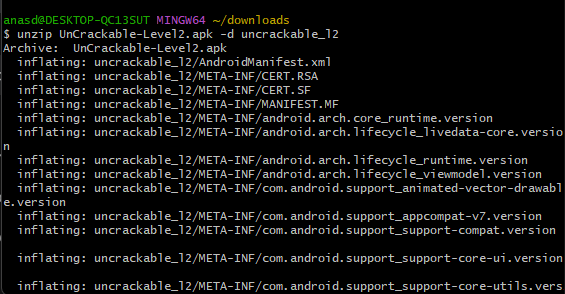

## Analyse du Manifeste et du Code Java

L'analyse du fichier AndroidManifest.xml permet d'identifier le point d'entrée de l'application

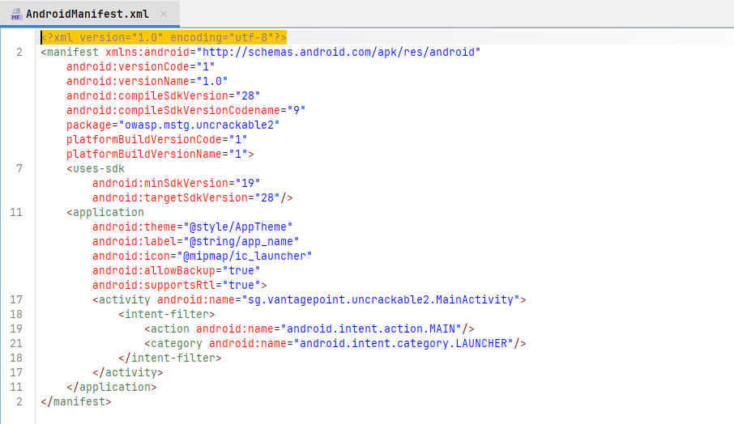

Dans la classe MainActivity, la fonction verify récupère le texte saisi par l'utilisateur et appelle this.m.a(string)

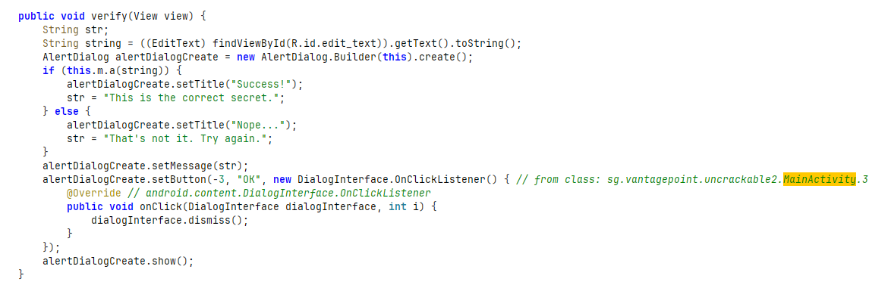

La classe CodeCheck (nommée m dans le code obfusqué) déclare une méthode native : private native boolean bar(byte[] bArr); . L'application charge la bibliothèque libfoo.so.

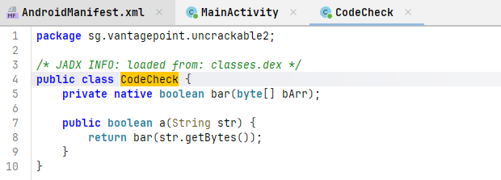

## unzip unckrackabel L2:

Puisque la validation est "native", nous devons utiliser Ghidra pour transformer le code machine de libfoo.so en pseudo-code C lisible.

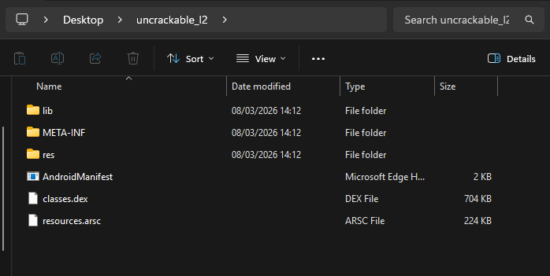

## Fichier lab qui contien librairie libfoo:
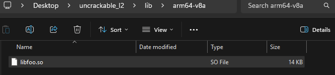

## lib foo:
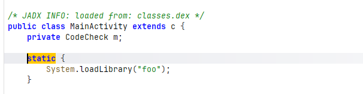
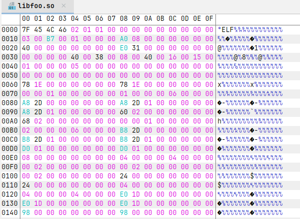

## outil GHIDRA:
Outil : Utilisation de ghidraRun.bat pour lancer l'environnement d'analyse
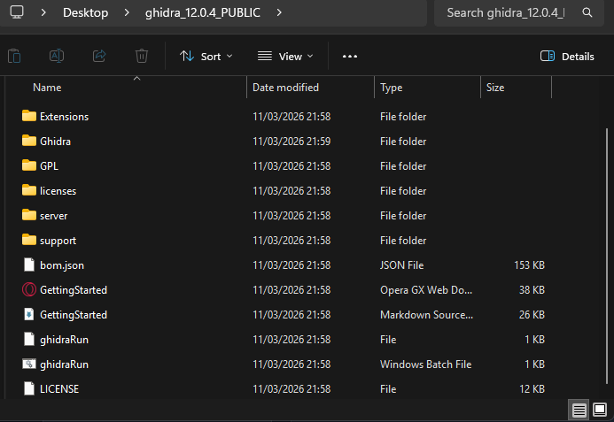

## ghidra lifoo file :
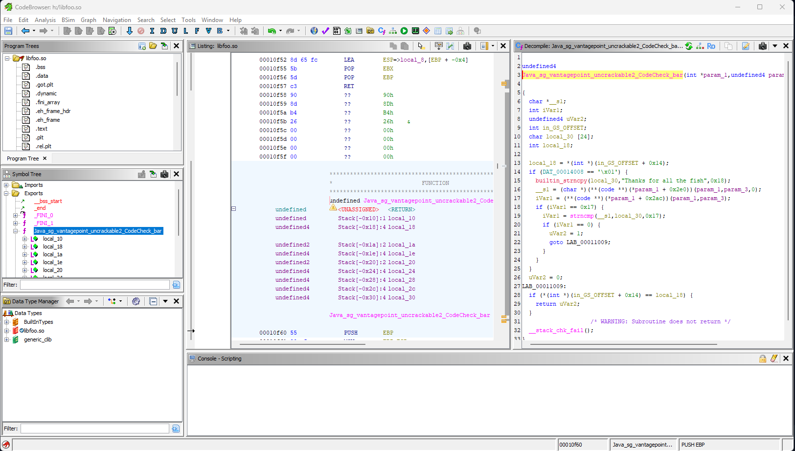

## Identification du Secret
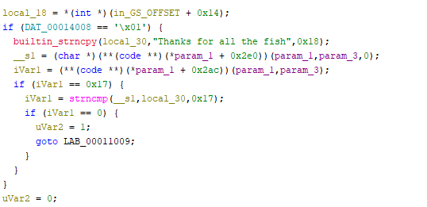
